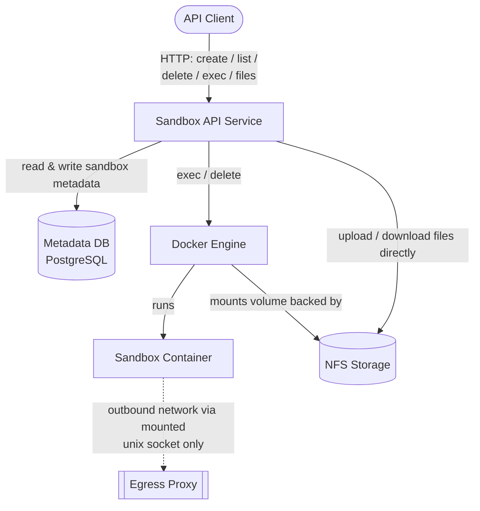

# Architecture

## 1. Overview

Simple POC tool to manage isolated, ephemeral execution environments for running agentic code. Each sandbox pairs container with a persistent, NFS-backed workspace volume. For simplicity each sandbox specifies concrete directory to be persisted (workspace), file system out of specified directory is ephemeral. Sandbox metadata is stored in postgres, so a sandbox's filesystem state (within workspace) persists across execs and is only deleted when the sandbox itself is deleted.

Authentication and authorization are **out of scope** for this document. Requests are assumed to already be authenticated (e.g. by an upstream gateway) by the time they reach this service.

## 2. Architecture



**Sandbox API Service** - stateless service exposing the REST API below. Concurrency for a given sandbox (exec vs. exec, exec vs. delete, exec vs. files) is enforced via database-backed distributed lock plus container naming strategy, see [Exec concurrency](#exec-concurrency).

**Metadata DB** - stores sandbox configuration (see [Data Model](#6-data-model)).

**Docker Engine** - creates the nfs-backed volume and container for a sandbox on each exec call, and disposes of both once the command finishes.

**NFS Storage** - durable storage for sandbox workspaces. Persists independently of the container/volume lifecycle. The API service can also read and write files here directly (`GET`/`POST /files`), without going through the container. To prevent data corruption, file manipulations are rejected while an exec is in flight for the sandbox.

### Container security profile

Containers are launched fresh for each exec call and hardened per Anthropic's [secure deployment guidance](https://code.claude.com/docs/en/agent-sdk/secure-deployment#containers):

```sh
docker run \
  --rm \
  --name $SANDBOX_ID \
  --cap-drop ALL \
  --security-opt no-new-privileges \
  --security-opt seccomp=/path/to/seccomp-profile.json \
  --read-only \
  --tmpfs /tmp:rw,noexec,nosuid,size=100m \
  --tmpfs /home/agent:rw,noexec,nosuid,size=500m \
  --memory 2g \
  --cpus 2 \
  --pids-limit 100 \
  --user 1000:1000 \
  -v $SANDBOX_ID:/workspace:ro \
  -v /var/run/proxy.sock:/var/run/proxy.sock:ro \
  agent-image
```

All capabilities are dropped, the root filesystem is read-only, resource limits are enforced, and the process runs as an unprivileged, non-root user. `--name` is the sandbox id and `--rm` removes the container automatically once the command exits.

## 3. Sandbox Operations

- **Create** allocates metadata and NFS storage only - nothing is provisioned in Docker.
- **Exec** creates a volume and a container, both named after the sandbox id, runs the command, and disposes of both when it finishes (see [Exec concurrency](#exec-concurrency)).
- **Delete** removes sandbox metadata and its NFS storage. It's rejected with `409 SANDBOX_EXECUTING` while an exec is running for the sandbox.
- **Files** (`GET`/`POST /files`) read/write NFS storage directly and are rejected with `409 SANDBOX_EXECUTING` while an exec is running for the sandbox, to avoid racing a container that's actively writing.

### Concurrency

For following operations distributed lock is acquired by sandbox id 
  - `POST /exec`
  - `POST /delete`
  - `POST /file`

Also each resource allocated in docker derives its name from sandbox id in deterministic way, which makes impossible for example to run multiple parallel containers for single sandbox (docker will reject it by name conflict).

Also each listed operation performs explicit sandbox execution state check before running:
1. Check if container exists by sandbox id. If it doesn't exist sandbox is not executing.
2. Check container state. Running container means sandbox is executing. When sandbox executing all operations are prohibited. 
3. If container is not running sandbox is not executing. Dead container and affiliated volume should be deleted.

Lock algorithm is following
1. Get row level lock by sandbox id.
2. Check if sandbox.locked_until is null or < now(). If so lock can be aqcuired.
3. Acquire lock by setting sandbox.locked_until = now() + 1 minute.
4. Perform operation. During operation execution locked_until should be updated periodically (for example every 5 second) by separate task.  
5. Release lock by setting sandbox.locked_until = null.

## 4. API Reference

```yaml
openapi: 3.0.3
info:
  title: Agent Sandbox API
  version: "1.0"
  description: >
    Manages the lifecycle of isolated, ephemeral agent execution environments.
paths:
  /sandboxes:
    post:
      summary: Create a sandbox
      description: >
        Creates sandbox metadata and allocates its NFS-backed storage.
        Does not start a container.
      parameters:
        - name: Idempotency-Key
          in: header
          required: true
          schema:
            type: string
            format: uuid
      requestBody:
        required: true
        content:
          application/json:
            schema:
              $ref: '#/components/schemas/CreateSandboxRequest'
      responses:
        '200':
          description: Sandbox created.
          content:
            application/json:
              schema:
                type: object
                required: 
                  - id
                properties:
                  id:
                    type: string
                    format: uuid
        '400':
          $ref: '#/components/responses/BadRequest'
    get:
      summary: List sandboxes
      responses:
        '200':
          description: List of sandboxes
          content:
            application/json:
              schema:
                type: array
                items:
                  $ref: '#/components/schemas/Sandbox'

  /sandboxes/{id}:
    parameters:
      - $ref: '#/components/parameters/SandboxId'
    get:
      summary: Provides sandbox details.
      responses:
        '200':
          description: Sandbox details.
          content:
            application/json:
              schema:
                $ref: '#/components/schemas/Sandbox'
        '404':
          $ref: '#/components/responses/NotFound'
    delete:
      summary: Deletes a sandbox.
      description: >
        Deletes sandbox metadata and its NFS storage. Rejected while an
        exec is in progress for the sandbox; otherwise, as a safety net,
        also makes a best-effort attempt to remove any container/volume
        left over under the sandbox id (e.g. from a crashed exec).
      responses:
        '204':
          description: Sandbox deleted.
        '404':
          $ref: '#/components/responses/NotFound'
        '409':
          description: An exec is in progress for this sandbox (SANDBOX_EXECUTING).
          content:
            application/json:
              schema:
                $ref: '#/components/schemas/Error'

  /sandboxes/{id}/exec:
    post:
      summary: Execute a command in a sandbox
      parameters:
        - $ref: '#/components/parameters/SandboxId'
      requestBody:
        required: true
        content:
          application/json:
            schema:
              $ref: '#/components/schemas/ExecRequest'
      responses:
        '200':
          description: Command output, streamed as Server-Sent Events from the container's stdout.
          content:
            text/event-stream:
              schema:
                type: string
        '404':
          $ref: '#/components/responses/NotFound'
        '409':
          description: Another exec is already running for this sandbox (SANDBOX_EXECUTING).
          content:
            application/json:
              schema:
                $ref: '#/components/schemas/Error'

  /sandboxes/{id}/files:
    parameters:
      - $ref: '#/components/parameters/SandboxId'
      - name: path
        in: query
        required: true
        schema:
          type: string
        description: File path relative to the sandbox volume root.
    get:
      summary: Download a file from the sandbox volume
      responses:
        '200':
          description: File contents
          content:
            multipart/form-data:
              schema:
                type: string
                format: binary
        '400':
          description: Path refers to a directory or symlink
          content:
            application/json:
              schema:
                $ref: '#/components/schemas/Error'
        '404':
          $ref: '#/components/responses/NotFound'
        '409':
          description: An exec is in progress for this sandbox (SANDBOX_EXECUTING).
          content:
            application/json:
              schema:
                $ref: '#/components/schemas/Error'
    post:
      summary: Upload a file to the sandbox volume
      description: Overwrites the file if it already exists.
      requestBody:
        required: true
        content:
          multipart/form-data:
            schema:
              type: object
              properties:
                file:
                  type: string
                  format: binary
      responses:
        '200':
          description: File uploaded
        '404':
          $ref: '#/components/responses/NotFound'
        '409':
          description: An exec is in progress for this sandbox (SANDBOX_EXECUTING).
          content:
            application/json:
              schema:
                $ref: '#/components/schemas/Error'

components:
  parameters:
    SandboxId:
      name: id
      in: path
      required: true
      schema:
        type: string
        format: uuid

  schemas:
    CreateSandboxRequest:
      type: object
      required: 
        - image
        - workspace
      properties:
        image:
          type: string
          example: my-agentic-app-image
        workspace:
          type: string
          example: /workspace

    Sandbox:
      type: object
      properties:
        id:
          type: string
          format: uuid
        image:
          type: string
        volume:
          type: object
          properties:
            path:
              type: string
        created_at:
          type: string
          format: date-time

    ExecRequest:
      type: object
      required: 
        - command
      properties:
        command:
          type: string
          example: "python agent.py --prompt '{\"tools\":[],\"messages\":[...]}'"

    Error:
      type: object
      required: 
        - error
      properties:
        error:
          type: object
          required: 
            - code, 
            - message
          properties:
            code:
              type: string
              example: SANDBOX_NOT_FOUND
            message:
              type: string

  responses:
    NotFound:
      description: "Resource not found"
      content:
        application/json:
          schema:
            $ref: '#/components/schemas/Error'
    BadRequest:
      description: "Malformed request"
      content:
        application/json:
          schema:
            $ref: '#/components/schemas/Error'
```

| HTTP Status | Code                                  | Description                                                                                 |
| ----------- | ------------------------------------- | ------------------------------------------------------------------------------------------- |
| 400         | `VALIDATION_ERROR`                    | Request body or query parameter is missing/malformed                                        |
| 404         | `SANDBOX_NOT_FOUND`                   | No sandbox exists with the given id                                                         |
| 409         | `SANDBOX_LOCKED`, `SANDBOX_EXECUTING` | Exec, delete, or file operation requested while an exec is already running for this sandbox |
| 500         | `INTERNAL_ERROR`                      | Unexpected server-side failure                                                              |

## 6. Data Model

**`sandbox`** - one row per created sandbox.

```sql
create table sandbox
(
    id         uuid primary key default gen_random_uuid(),
    image      text not null,
    workspace  text not null,
    locked_at  timestamptz,
    created_at timestamptz not null default now(),
    deleted_at timestamptz
);
```

`workspace` is the directory inside the container to persist. Its NFS-side location is not stored - it's derived deterministically from the sandbox id (e.g. `{nfs_root}/{id}`), and the per-exec container and volume are likewise both just named after the sandbox id (see [Exec concurrency](#exec-concurrency)).

## 7. Out of scope/Future work

- Container -> MicroVM replacement
- Full FS persistence
- Move sandbox to archived state
- Distributed NFS
- Distributed control plane
- Authentication