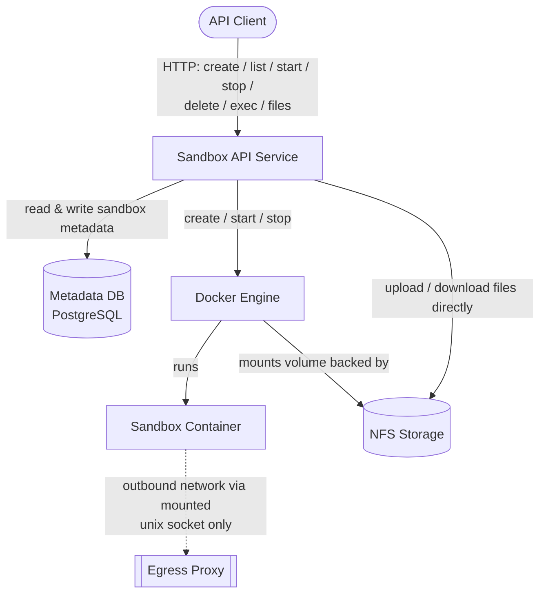
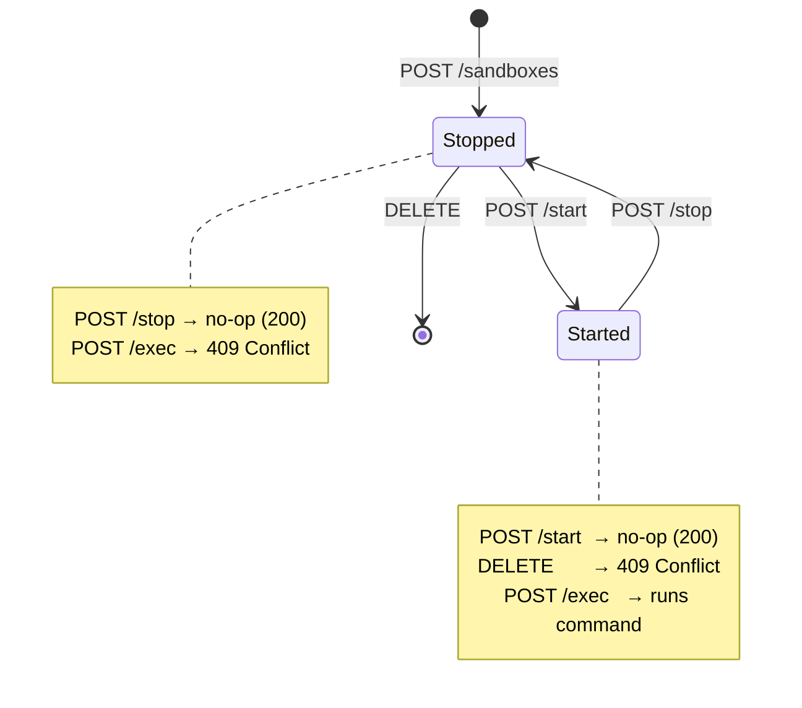

# Architecture

## 1. Overview

Simple POC tool to manage isolated, ephemeral execution environments for running agentic code. Each sandbox pairs container with a persistent, NFS-backed workspace volume. For simplicity each sandbox specifies concrete directory to be persisted, file system out of specified directory is ephemeral. Sandbox metadata is stored in postgres, so a sandbox can be stopped and restarted without losing its filesystem state (within specified directory), and its data is only deleted when the sandbox itself is deleted.

Authentication and authorization are **out of scope** for this document. Requests are assumed to already be authenticated (e.g. by an upstream gateway) by the time they reach this service.

## 2. Architecture



**Sandbox API Service** - stateless service exposing the REST API below. Serializes state-changing operations per sandbox (create/start/stop/delete) behind a per-sandbox lock, so concurrent requests against the same sandbox don't race.

**Metadata DB** - stores sandbox configuration and the history of container starts/stops (see [Data Model](#6-data-model)).

**Docker Engine** - creates and runs the container for a sandbox, and creates the volume backing its workspace. The container's entrypoint is overridden to `/bin/sh` so it stays alive independent of the image's default command; `exec` is then used to run commands inside it.

**NFS Storage** - durable storage for sandbox workspaces. Persists independently of the container lifecycle. The API service can also read and write files here directly (`GET`/`POST /files`), without going through the container. To prevent data violation files manipulations only allowed while sandbox is stopped. 

### Container security profile

Containers are launched hardened per Anthropic's [secure deployment guidance](https://code.claude.com/docs/en/agent-sdk/secure-deployment#containers):

```sh
docker run \
  --cap-drop ALL \
  --security-opt no-new-privileges \
  --security-opt seccomp=/path/to/seccomp-profile.json \
  --read-only \
  --tmpfs /tmp:rw,noexec,nosuid,size=100m \
  --tmpfs /home/agent:rw,noexec,nosuid,size=500m \
  --memory 2g \
  --cpus 2 \
  --pids-limit 100 \
  --user 1000:1000 \
  -v /path/to/code:/workspace:ro \
  -v /var/run/proxy.sock:/var/run/proxy.sock:ro \
  agent-image
```

All capabilities are dropped, the root filesystem is read-only, resource limits are enforced, and the process runs as an unprivileged, non-root user.

## 3. Sandbox Lifecycle

A sandbox has two externally visible states, `started` and `stopped`. A newly created sandbox starts in `stopped` (no container exists yet); it behaves identically to a sandbox that was previously started and then stopped.



- **Create** allocates metadata and NFS storage only - no container is started.
- **Start** is idempotent: starting an already-started sandbox is a no-op. Otherwise it creates the volume, creates the container bound to that volume, and starts it.
- **Stop** is idempotent: stopping an already-stopped sandbox is a no-op. Otherwise it removes the container and volume; metadata and NFS storage are preserved.
- **Delete** removes sandbox metadata and its NFS storage. It's only allowed while the sandbox is `stopped`.
- **Exec** requires the sandbox to be `started`.

## 4. API Reference

```yaml
openapi: 3.0.3
info:
  title: Agent Sandbox API
  version: "1.0"
  description: >
    Manages the lifecycle of isolated, ephemeral agent execution environments.
paths:
  /sandboxes:
    post:
      summary: Create a sandbox
      description: >
        Creates sandbox metadata and allocates its NFS-backed storage.
        Does not start a container.
      parameters:
        - name: Idempotency-Key
          in: header
          required: true
          schema:
            type: string
            format: uuid
      requestBody:
        required: true
        content:
          application/json:
            schema:
              $ref: '#/components/schemas/CreateSandboxRequest'
      responses:
        '200':
          description: Sandbox created.
          content:
            application/json:
              schema:
                type: object
                required: 
                  - id
                properties:
                  id:
                    type: string
                    format: uuid
        '400':
          $ref: '#/components/responses/BadRequest'
    get:
      summary: List sandboxes
      parameters:
        - name: state
          in: query
          required: false
          schema:
            type: string
            enum: 
              - started
              - stopped
          description: Filter sandboxes by current state.
      responses:
        '200':
          description: List of sandboxes
          content:
            application/json:
              schema:
                type: array
                items:
                  $ref: '#/components/schemas/Sandbox'

  /sandboxes/{id}:
    parameters:
      - $ref: '#/components/parameters/SandboxId'
    get:
      summary: Provides sandbox details.
      responses:
        '200':
          description: Sandbox details.
          content:
            application/json:
              schema:
                $ref: '#/components/schemas/Sandbox'
        '404':
          $ref: '#/components/responses/NotFound'
    delete:
      summary: Deletes a sandbox.
      description: Deletes sandbox metadata and its NFS storage. The sandbox must be stopped.
      responses:
        '204':
          description: Sandbox deleted.
        '404':
          $ref: '#/components/responses/NotFound'
        '409':
          description: Sandbox started.
          content:
            application/json:
              schema:
                $ref: '#/components/schemas/Error'

  /sandboxes/{id}/start:
    post:
      summary: Starts a sandbox.
      description: >
        Creates and starts the sandbox's container and volume.
        No-op if the sandbox is already started.
      parameters:
        - $ref: '#/components/parameters/SandboxId'
      responses:
        '200':
          description: Sandbox started (or already running).
        '404':
          $ref: '#/components/responses/NotFound'
        '409':
          $ref: '#/components/responses/ConcurrentModification'

  /sandboxes/{id}/stop:
    post:
      summary: Stops a sandbox.
      description: >
        Removes the sandbox's container and volume. Metadata and NFS
        storage are preserved. No-op if the sandbox is already stopped.
      parameters:
        - $ref: '#/components/parameters/SandboxId'
      responses:
        '200':
          description: Sandbox stopped (or already stopped)
        '404':
          $ref: '#/components/responses/NotFound'
        '409':
          $ref: '#/components/responses/ConcurrentModification'

  /sandboxes/{id}/exec:
    post:
      summary: Execute a command in a sandbox
      parameters:
        - $ref: '#/components/parameters/SandboxId'
      requestBody:
        required: true
        content:
          application/json:
            schema:
              $ref: '#/components/schemas/ExecRequest'
      responses:
        '200':
          description: Command output, streamed as Server-Sent Events from the container's stdout.
          content:
            text/event-stream:
              schema:
                type: string
        '404':
          $ref: '#/components/responses/NotFound'
        '409':
          description: Sandbox is not started
          content:
            application/json:
              schema:
                $ref: '#/components/schemas/Error'

  /sandboxes/{id}/files:
    parameters:
      - $ref: '#/components/parameters/SandboxId'
      - name: path
        in: query
        required: true
        schema:
          type: string
        description: File path relative to the sandbox volume root.
    get:
      summary: Download a file from the sandbox volume
      responses:
        '200':
          description: File contents
          content:
            multipart/form-data:
              schema:
                type: string
                format: binary
        '400':
          description: Path refers to a directory or symlink
          content:
            application/json:
              schema:
                $ref: '#/components/schemas/Error'
        '404':
          $ref: '#/components/responses/NotFound'
    post:
      summary: Upload a file to the sandbox volume
      description: Overwrites the file if it already exists.
      requestBody:
        required: true
        content:
          multipart/form-data:
            schema:
              type: object
              properties:
                file:
                  type: string
                  format: binary
      responses:
        '200':
          description: File uploaded
        '404':
          $ref: '#/components/responses/NotFound'

components:
  parameters:
    SandboxId:
      name: id
      in: path
      required: true
      schema:
        type: string
        format: uuid

  schemas:
    CreateSandboxRequest:
      type: object
      required: 
        - image
        - volume
      properties:
        image:
          type: string
          example: my-agentic-app-image
        volume:
          type: object
          required: 
           - path
          properties:
            path:
              type: string
              example: /workspace

    Sandbox:
      type: object
      properties:
        id:
          type: string
          format: uuid
        image:
          type: string
        volume:
          type: object
          properties:
            path:
              type: string
        state:
          type: string
          enum: 
            - started
            - stopped
        created_at:
          type: string
          format: date-time

    ExecRequest:
      type: object
      required: 
        - command
      properties:
        command:
          type: string
          example: "python agent.py --prompt '{\"tools\":[],\"messages\":[...]}'"

    Error:
      type: object
      required: 
        - error
      properties:
        error:
          type: object
          required: 
            - code, 
            - message
          properties:
            code:
              type: string
              example: SANDBOX_NOT_FOUND
            message:
              type: string

  responses:
    NotFound:
      description: "Resource not found"
      content:
        application/json:
          schema:
            $ref: '#/components/schemas/Error'
    BadRequest:
      description: "Malformed request"
      content:
        application/json:
          schema:
            $ref: '#/components/schemas/Error'
    ConcurrentModification:
      description: "Concurrent modification to same resource"
      content:
        application/json:
          schema:
            $ref: '#/components/schemas/Error'
```

| HTTP Status | Code                      | Description                                                                 |
| ----------- | ------------------------- | --------------------------------------------------------------------------- |
| 400         | `VALIDATION_ERROR`        | Request body or query parameter is missing/malformed                        |
| 404         | `SANDBOX_NOT_FOUND`       | No sandbox exists with the given id                                         |
| 409         | `SANDBOX_RUNNING`         | Delete requested while the sandbox is started                               |
| 409         | `SANDBOX_NOT_STARTED`     | Exec requested while the sandbox is stopped                                 |
| 409         | `CONCURRENT_MODIFICATION` | Another start/stop/delete operation is already in progress for this sandbox |
| 500         | `INTERNAL_ERROR`          | Unexpected server-side failure                                              |

## 6. Data Model

**`sandbox`** - one row per created sandbox.

```sql
create table sandbox
(
    id         uuid primary key default gen_random_uuid(),
    config     jsonb not null,        -- creation input: image, volume path, etc.
    data       jsonb not null,        -- NFS reference, released on deletion
    created_at timestamptz not null default now(),
    deleted_at timestamptz
);
```

**`sandbox_start`** - one row per start.

```sql
create table sandbox_start
(
    id         uuid primary key default gen_random_uuid(),
    sandbox_id uuid not null references sandbox(id),
    data       jsonb not null,        -- container and volume id, released on stop
    started_at timestamptz not null default now(),
    stopped_at timestamptz
);
```

## 7. Out of scope/Future work

- Authentication
- Container -> MicroVM replacement
- Full FS persistence
- FS compression
- Distributed NFS
- Distributed control plane